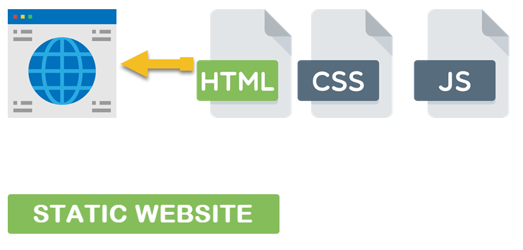
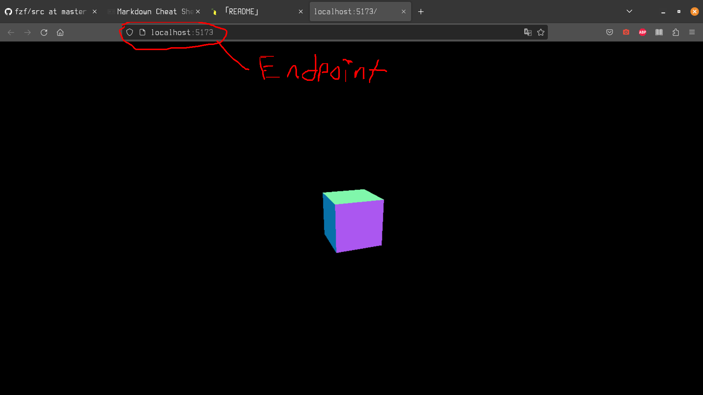
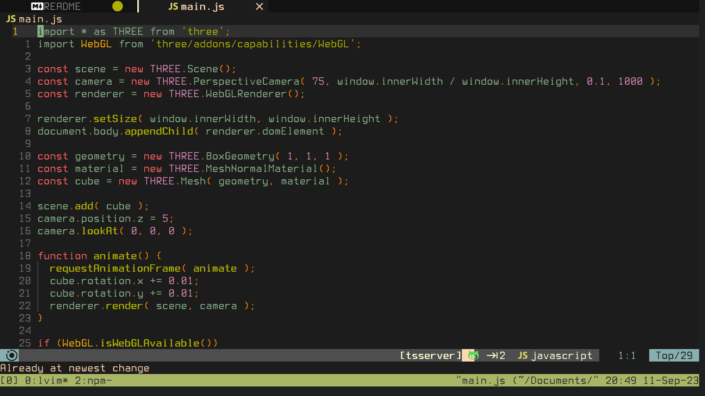
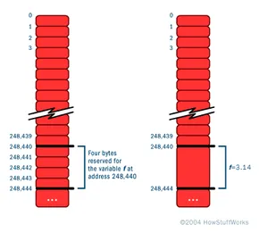
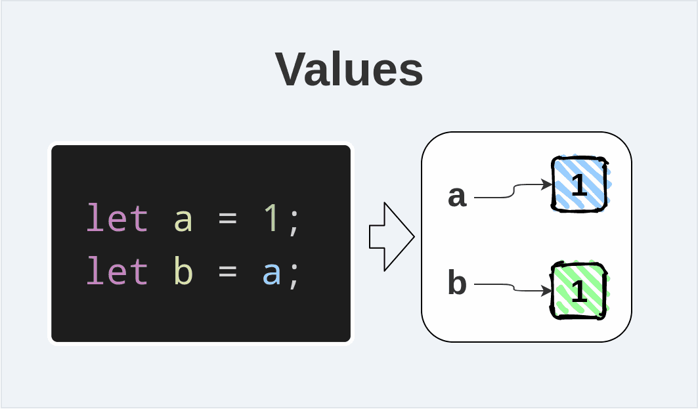
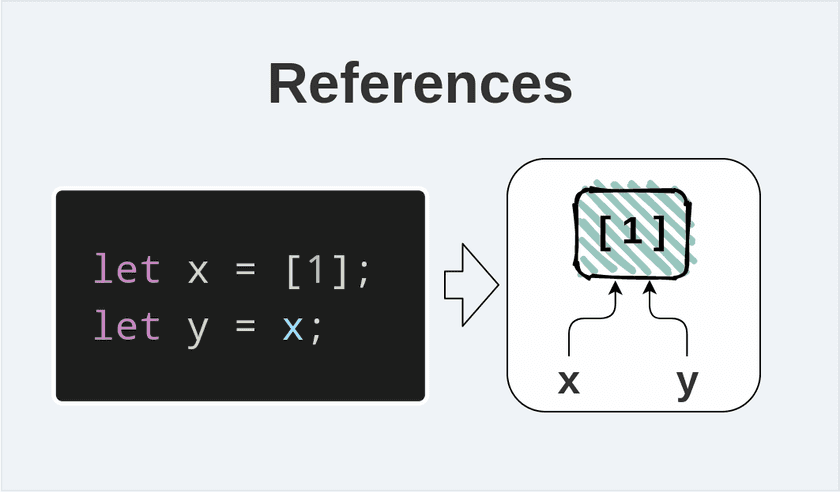

## This is a basic example of a modern web development project.

### Requirements:
git, wget, npm, and node. That's it. Don't worry about the exact deails of what any of this is for now. Google them individually on you own at some point but a brief overview will be given at the bottom. 

Assuming Debian based system (Ubuntu, Mint, etc.)

    sudo apt update && sudo apt upgrade && sudo apt install git wget

To install git and it is recommended that you use nvm to install both npm and node. 

    wget -qO- https://raw.githubusercontent.com/nvm-sh/nvm/v0.39.5/install.sh | bash
    
Confirm nvm is installed with 
    
    nvm --version

Once confirmed successful install latest node version with

    nvm install node

and use node with

    nvm use node

Confirm both node and npm were installed succesfully with  

    node --version

and

    npm --version

### To start:

    1. Fork this repo and "git clone <repo>" where <repo> is of course your fork of this
    2. Run 'npm install' to install all the dependencies of this project which are only two packages
        a. threejs (three) 
        b. vite (vite)
    3. Run 'npm run test'
    4. ctrl click the link that appears and you should see the cube demo of the threejs scene being 
       rendered

    Skip to problem and question section if you don't need a verbose explanation of web development

### Overview (backend):

I will give a brief overview of terms and the technologies used in modern web development. We all know that the basic components of a site is HTML, CSS, and Javascript. 

Here is where I will briefly mention servers and common terminologies. Namely what a **static** site is as this is what is being served to the browser in this project. A quick note.

    A lot of beginner web developers have the problem where they assume terminology too quickly. 

A relevant example of something I ran into interviewing junior devs. A **static** site does not mean it does not contain interactive elements with Javascript. Simply, it means a site that is returned as is by the server. A **dynamic** web page is one in which a intermediary program/framework generates the HTML, CSS, Javascript, to be returned. Servers respond to requests to an **endpoint** and serves the web page to the browser. If that is all that happens, it is a **static** site.

Lesson here is don't assume haphazardly. Especially starting out. 

An **endpoint** being simply a way to designate the location of a resource. In the case of this demo project it would be a **url**. A uniform resource locator. Simply a identifier for the server to know what to return back to the browser.

Do not concern yourself with **dynamic** sites for now. Understanding how a site is served in the context of this demo is the focus.

So now that we have all that cleared up let's see how this demo "serves" a **static** site back to you.

You might be thinking, "Server? that sounds complicated. How am I gonna configure a whole server to server back my website?". Well don't worry. If you followed the steps above you can see that a site was served back you that renders a cube. 
 

How you may ask is this happening. Let's tie this back in to this concept of a **static** site (see image above again). How is it serving HTML, CSS, and Javascript back to us? A good approach here is to have a reasonable level of abstraction. Treating things as a **black box**.

Meaning, we will just understand the overarching concepts like **static** sites being served to us and not concern ourselves with the actual nitty gritty implementation. We are being served a **static** site but let's at least know what is doing it, (the **black boxes**) and not be too hung up on EXACTLY how. 

#### Node and NPM

The short of it is that **node** is handling this for us. But what exactly is **node**? I'll fail to encapsulate in its entirety exactly what it is but remember, **black box**. For now lets think of it simply as Javascript running on the **backend**. 

The **backend** is the side of the server. In this context it is the program that is running that is responsible for giving us back things requested at the **endpoint**

The **frontend** is the page that is returned back. It is what has all the HTML, CSS, and Javascript. It would be fair to say it is composed of the three things. All a browser needs to render a page though is HTML.

So **node** is what is responsible for running the Javascript that returns our **frontend** code. The page with the cube. But we didn't write any Javascript to do this right? This is where **packages** and **npm** come into play. 

**packages** are simply code that has been written by someone else that we are using. And **npm** is **nodes** package manager. Like the name states it is what grabs this code that other people wrote and lets us use them. Remember when we ran "npm install". We installed these packages then. The packages are specified in the "packages.json" file inside the demo directory. Leave it alone for now but pop it open at some point. 

So our "vite" package is what is running and serving back our site to us. But how does it know exactly what to return back? Again, "packages.json". It is what holds the configuration for **node** and all the packages it is using to know exactly what to do.

Now let us see what code is being returned back. Open "index.html" and "js/main.js" and look at what being displayed by the browser. This is the code is being "interpreted" by the browser and "rendered" as a spinning cube.

So let's summarize what is going on. **node** is running code that is returning back our **static** site at the specified **endpoint**. In this way "vite" is acting as a server for us. Which is this page with the spinning cube. The code that **node** is running to do this is the "vite" **package** that we included with **npm**. Now let's go over the **frontend**. 

### Overview (frontend):

    TIP: Have this open side by side with the code. It can't be understated how helpful this is when
         reading something that refers back to it.

Inside the "js/main.js" file that you have open look at the top of the file. You should see the code that is including in threejs. Threejs (three) is the package that we included in with **npm** that is rendering the cube with Javascript. 

Let's adopt this **black box** mentality again. Focus just what is in front of you. This code is what we would consider "modern" Javascript code. So what makes this code "modern". Well a congregation of nerds decide on a standard for Javascript every other year. They propose changes and updates to Javascript that then different vendors (Mozilla, Google, Microsoft, etc.) then have to support. In this case, in the browser and with **node**.

This "modern" Javascript is being ran on the brower as **frontend** code.

"import ..." at the top of the file is one of the most important things included in this "modern" Javascript standard. It is what is including in the "threejs" code that we grabbed from **npm**. A brief overview of this code you can see some "complicated" things happening.

At the top with the "imports" we are just including in the code from the "threejs" package (known simply as "three"). 

Next we see the **state** of the program being defined. At its simplest, a program define things to hold in memory and the operates on it. We are declaring them as "const" here as you can see. Another bit of "modern" Javascript here. What it means is that the variable can't be reassigned. It will always refer to the same thing. It is good practice to define things as "const" when we don't want certain things to not change in the **runtime** of our program.

I said a bunch of stuff here that is important to understand on a programming fundamentals level. I haven't even gotten into what the code is doing yet but let's understand a little bit of how the code is doing what it is doing for a minute. Stepping into the **black box** a smidgen here. 

In this context the **black box** that I am referring to is to how code typically is loaded into memory and is executed. I will tie this back into this idea of "const" as it is a good enough example while also tying back into what we are doing here with Javascript. 

Again, let's break it down. A integral approach to programming. 

**state**: Exactly what is it? Well simply put it is the "memory" of the program. Memory is constantly evolving and changing in the **runtime** of the program if it does anything intersting. 

**runtime**: The lifetime of the program. What is in memory and what is being done while the program is running. It ends when you close it. In this context when you close the tab or the browser. A lot of thought goes into here. Like efficiency and making sure that when you actually close the program it frees up any resources (memory, processes, etc.) that it was using. In our case here with Javascript, the browser should handle all this for us. Where the **frontend** code is being ran. 

So a **const** variable is "immutable". Which means the variable that is referring to these **objects** in our code can't be reassigned during the whole **runtime**. It can't **reference** something else. Here is where the devil in the detail though.

Notice how I said **reference** explicitly. The variable aren't the **objects** in memory themselves, they point to them. Refer to them. If you have no way of referring to an **object**, they will be cleaned up by Javascript since there is no way of accessing their data so it would just go to waste. If you think of your gamer RAM stick as blocks of memory **references** will make a lot more sense.

The blocks each have their own "address" that is unique that refers the location in memory they are located at. A variable is just a way for us as programmers to have names for these memory addresses that hold our data during the **runtime** of our program.

In Javascript variables can always **reference** the same **object** but they never reference the same **primitive** in memory. Both boil down to data in memory but Javascript has distinct rules for how they are assigned to variables. To really hammer in this concept of **references** this is an important thing to note.

What are Javascript **primitives**? Everything not an **object** to keep it dead simple. These are strings, numbers, booleans, null, undefined, and symbols. 

**primitives** are always assigned by value in Javascript. 

When 'b' is assigned to 'a', it doesn't point to the same location in memeory (address). Instead it has it's own block of memory that has a copy of the value assigned to 'a', 1 in this case. Assignment is also where memory allocation can take place.

**objects** are always assigned by reference. 

'a' and 'b' both point to the same location in memory. Meaning, any changes you make to the object with 'b', it will be the same for 'a' because they are referring to the same thing just through different names. So if you update the array object with, 'b[0] = 2'. 'a[0]' will also be 2 now.

Yes, arrays are objects. If still confused see [here](https://dmitripavlutin.com/value-vs-reference-javascript/). Where I stole the images and should have a much better explanation. Which should also hopefully futher solidify the concept of "references" which is extremely important concept in programming.

Let's flesh out this concept of **objects** here though.

**Objects** in Javascript and in programming in general are a way for us to group a bunch of variables together under one "thing". Thing in this context refers to the concept of "abstraction". A way of grouping relevant things together to accomplish something. Grouping variables (data) and functions (methods) together to accomplish something that it is all related to.

Let's look at a concrete example. Look at the "const geometry" variable and what **object** it is referring to.

Now I will explain a little bit about what the code is actually doing a bit as it will help solidify this concept of abstraction. This "const geometry" variable is referring to this "BoxGeometry" object. "new" is the way we ask for a new chunk of memory to be allocated (given) to store all our "BoxGeometry" data. And the "THREE" is just the "namespace" it is under. Namespace is just a way of organizing code. We know explicitly that it is part of "threejs" and if we implement our own "BoxGeometry" for some reason they do not conflict with each other. Javascript will let you know if that happens. Namespaces are a way of avoiding that.

What do you think "BoxGeometry" is for? I mean, unless someone is trying to mislead you or just bad a coding most times the names we give for **objects** usually refer to what they are for. So without referring to the doc, let's try to think about it. We can "assume" this time for the sake of understanding this concept of "abstraction".

We can see what parameters (arguments) it takes in. It's all numbers. 1 to be exact. If we assume that "BoxGeometry" has to do with the geometry of the cube we are rendering then we can infer that we are specifying the dimensions of the cube. That it has a width, length, and height variable being assigned here. Check the doc later to confirm but I'll just tell you yeah it does.

So we have an object that holds all the geometry data of the cube being rendered. It is reasonable to have an object just for this. Why? It "makes sense" to organze code this way. If we have to write a whole thing just to hold cube data every time we want a box shape it would be a bit much. All the relevant functions that operate on the geometry data of this box geometry data also is in this object. Something like "geometry.scaleWidth(5)" or something like it could reasonably be in this object that scales the width by multiplying the "width" variable in the **object** by 5. Check at some point and see what you find.

Okay, one last thing before we go over very very briefly what the code is doing. I swear. The concept of **scope**

**scope**: Very generally it is how we organize the access to memory in our program by variables. If you look at our "main.js" file you see that I have everything in the "global scope". 

The "global **scope**" is where everything in our program can access. Meaning all the variables. A scope in javascript is defined by curly brackets, "{}". This is why our functions have them. It allows us to define variables only within the scope of our function. Why? because it is only relevant within the function. This is a nice way of organizing and making code efficient. This is the reason for this concept of **scope**. We want to organize our code to be readable but also we only want things loaded into memory (operations mostly in the case of functions) when they are needed. We only want/need the variable when we use it in the scope of a function. 

In our "main.js" everything is in the "global **scope**". This is fine for a small program like this where we don't have data that only needs to be in a certain **scope**. I'll give some problems at the end that will have you at some point adding variables only in a **scope**.

So this all might seem intimidating but I would consider these core tenets of programming in Javascript and programming in general. A rough understanding is fine for now as it should solidify as you program with these concepts in mind. 

### Overview (the program)

So finally here we are. This time I'll actually keep it brief since the "threejs" docs explain it way better than I could ever. 

    1. We import in THREE that has access to all of the threejs code written for us
    2. We define a bunch of const variables, that we use to render the cube
        a. Scene: The object that will hold everything to be displayed
        b. Camera: The perspective of how we look at things in the scene
        c. Renderer: What renders the scene with the objects from a certain perspective 
        d. Geometry: The object that holds the points of the cube
        e. Material: The color of the cube and how it interacts with lighting
        f. Cube: The cube object itself that has geometry and material
    3. We then set the size of the rendere based on the window size of the browser
    4. Inject renderer into our HTML
    5. Add cube to the scene and set the camera
    6. Define a function that actually now renders our cube and spins it
    6. Check if the browerd can even support our rendering, render if yes, error if no

And that's it. Devil is in the detail but again
[threejs](https://threejs.org) can explain things way better than I can. Go over the doc. You don't have to go through each thing in the "Reference" section. That's just there to look up stuff as you "assume" some things to look up like we did above as a way of problem solving. Wondering how something works and seeing if how it actually works by having an assumption guide you to the answer.

For questions either ask me or 
[mozilla](https://developer.mozilla.org/en-US/docs/Web/JavaScript) which has the best Javascript doc in my opinion. It is time to move past W3Schools.

### Problems and Questions

As promised here is a list of questions/problems that in increasing difficulty that should guide you. As you do each problem commit each solution to github. Each problem builds on the previous one so you won't be starting a new repo for each on. This way you can see your progress and git experience is good. Questions are mainly there as things too look into and think about to understand the code.

    NOTE: Vite supports something called hot module replacement. Which is nice. 
    After you run "npm run test" as long as you have it running any changes you make to the code 
    should update in the browser. Ctrl-c to kill vite.

Q: Where is the Javascript code being included in the html? See anything special?

Q: What is the difference between **primitive** types and **objects** in Javascript?

Q: What is the difference between defining and declaring a variable?

Q: let vs var. What is the difference? Ties into the concept of scope and declaring/defining variables.

Q: We don't define "document" in the Javascript code. Where is it from and what is it?

Q: What are "domElements" and how do we "inject" the renderer into the HTML? (Look at main.js)

Q: We call "animate" inside of the "animate" function. What is this called and how does it work?

Q: We don't refer to "animate" how we would normally refere to a function, i.e. "animate()" with the parentheses. Why is this allowed?

P: Change the background color of the scene. The abyss is scary. Make it a brighter color that doesn't kill your eyes to look at while you work on this.

P: So I said **runtime** efficiency is a concern in programming. But we have code that check if the browser can support rendering. Isn't this a waste to define all this stuff if in the end we can't even show the cube? Make it so we check first so that we don't wastefully allocate anything if "WebGL" isn't supported. 

Q: What is WebGL?

Q: What is threejs then?

P: Cube is spinning. Let's have it change color every frame as well as it spins. Randomly xD for the lulz. You want to use a different material that lets you change its color. Hint: we have objects in objects. Meaning we have a cube "Mesh" object that has it's own variables that references the geometry and material we passed in as arguments. If you want to change the cube color you should reference the material object we passed in. You want to access variable color in material in the cube. (Hint: "cube.material.?"). Also you probably need to add some lighting to the scene. Ambient should be fine. 

    NOTE: Notice how we access the material object in cube.

P: Instead of updating the color in the above way change the color by updating the "const material" color we passed into the "Mesh" object. "material.color"

Q: Did it work? It did if you did it right. How? (Hint: Think back on what it means to assign by reference)

P: Let's add more cubes. Have 10 spinning around in view. Have them all change to the same random color every frame. You'll need to put them in different positions. Keep them all in view. You can move the camera back a bit to do so. Remember size and position values are all relative. Meaning if something is 1 big having the camera a distance of 1000 away will make it tiny or even not even viewable. 

Q: Did you redefine material and geometry for each cube? Why can't they share? Spoilers they can totaly share. Why and why is that a good thing?

P: Now have each cube change a random color.

Q: Spoilers if you looked at this question ahead of time. They can't share a material now if you want them all to change colors differently. Why?

P: Have the cubes be different shapes. Can't be sharing geometry anymore.

P: Screw cubes, let's have spheres now. Replace the cubes with spheres.

P: Screw just spinning around. Can't really tell with a smoother surface if they are spinning. Let's have them move around the scene. Try to keep them in site. Up and down and left to right is good enough. Don't want them flying off into the abyss so have them moving along a line back and forth all different directions utilizing x, y, and z.

P: Let's have them coodinated now like them olympic synchnoized swimmers. Orbit a center point and have them move in a circle evenly spaced out. It is math time. Wanna see all of them so pick the right plane (x, y, or z?) for them to be moving in.

If you've noticed I've added more and more concepts with each problem and question. Diving deeper into an aspect of a **black box**. But always focusing back on how it is relevant to a problem. This is the approach to tackle programming problems. Identify the relevant **black boxes**, know what they do, and then when you need to dive deeper into them while keeping the focus narrowed on what you want to solve. 

Below are hardest problems.

P: Biggest hurdle yet. Collision detection. This will be the wall to overcome. Have all spheres moving randomly about this correct plane you chose. But if they hit a side of the screen have them bounce back. You are going to have to think about the screen space and the scene space and what that means. Vectors are another concept to understand and how to apply them. You can use a package but it is not necessary for simple collision detection like this with a sphere.

P: Have the 10 spheres now have collision detection with each other as well. You should see them bouncing around off each other in the the box that is renderer.

P: Let's finally dive deeper into the build tools we used in this project. Open package.json. Understand it lol. A good portion is just descriptive stuff but there is a lot when it comes to dev setups. For now the basics is what is important. Add some packages for code linting and unit tests. Write a section in scripts for code linting. Write some unit tests in Javascript. It's fine if the tests are arbitrary. Add a script section to run unit tests.

P: Last one. If you made it here you have programming in general down but one last push can't hurt. Only 10 spheres bouncing around? Let's see how many you can add till it starts slowing down. Threejs has a helper that adds a fps counter in the corner. Add that in. Now figure out a way to keep it a consistent frame rate. The exact number of spheres you can support is honestly not known. But you can definitely have more than 10. Maybe even limit the frame rate to 30. Think about Big O. Where is the programming doing the most work and look into how shaders can help you push rendering performance.
